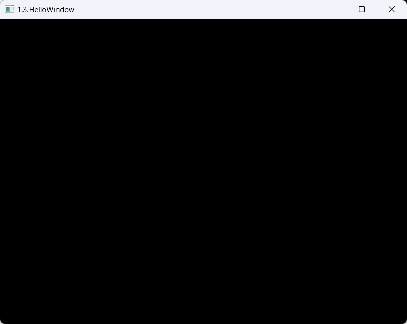
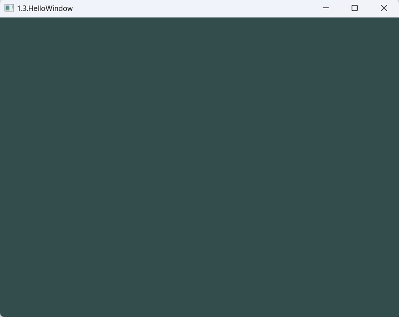

# 1.3.你好窗口

在环境配置好之后，就可以创建窗口了

引入头文件：

```cpp
#include <glad/glad.h>
#include <GLFW/glfw3.h>
```

**glad必须在GLFW前面**

## 初始化GLFW

需要传入OpenGL的版本号，我的是4.6.0

```cpp
glfwWindowHint(GLFW_CONTEXT_VERSION_MAJOR, 4);
glfwWindowHint(GLFW_CONTEXT_VERSION_MINOR, 6);
glfwWindowHint(GLFW_OPENGL_PROFILE, GLFW_OPENGL_CORE_PROFILE);
```

## 创建一个GLFW窗口

传入一个宽度和高度，窗口标题传入中文的话会乱码

```cpp
GLFWwindow* window = glfwCreateWindow(800, 600, "1.3.HelloWindow", NULL, NULL);
if (window == NULL) {
    std::cout << "Failed to create GLFW window" << std::endl;
    glfwTerminate();
    return -1;
}
glfwMakeContextCurrent(window);
```

## 初始化GLAD

GLAD是用来管理OpenGL的函数指针的，所以在调用任何OpenGL的函数之前我们需要初始化GLAD。

```cpp
if (!gladLoadGLLoader((GLADloadproc)glfwGetProcAddress))
{
    std::cout << "Failed to initialize GLAD" << std::endl;
    return -1;
}
```

## 初始化视口

```cpp
// 初始化视口，并设置窗口变化时，视口的变化函数
glViewport(0, 0, 800, 600);
glfwSetFramebufferSizeCallback(window, framebuffer_size_callback);
```

## 渲染循环

初始化工作已经完成，使用渲染循环不断绘制图像

```cpp
while(!glfwWindowShouldClose(window))
{
    glfwSwapBuffers(window);
    glfwPollEvents();    
}
```

- `glfwWindowShouldClose`函数在我们每次循环的开始前检查一次GLFW是否被要求退出，如果是的话该函数返回true然后渲染循环便结束了，之后为我们就可以关闭应用程序了。
- `glfwPollEvents`函数检查有没有触发什么事件（比如键盘输入、鼠标移动等）、更新窗口状态，并调用对应的回调函数（可以通过回调方法手动设置）。
- `glfwSwapBuffers`函数会交换颜色缓冲（它是一个储存着GLFW窗口每一个像素颜色值的大缓冲），它在这一迭代中被用来绘制，并且将会作为输出显示在屏幕上。


## 程序退出

退出时清理数据

```cpp
glfwTerminate();
return 0;
```

到这里已经可以运行了



## 处理键盘输入

我们同样也希望能够在GLFW中实现一些输入控制，这可以通过使用GLFW的几个输入函数来完成。

我们将会使用GLFW的`glfwGetKey`函数，它需要一个窗口以及一个按键作为输入。这个函数将会返回这个按键是否正在被按下。我们将创建一个`processInput`函数来让所有的输入代码保持整洁。

```cpp
void processInput(GLFWwindow *window)
{
    if(glfwGetKey(window, GLFW_KEY_ESCAPE) == GLFW_PRESS)
        glfwSetWindowShouldClose(window, true);
}
```

这里我们检查用户是否按下了返回键(Esc)（如果没有按下，`glfwGetKey`将会返回`GLFW_RELEASE`。

如果用户的确按下了返回键，我们将通过`glfwSetwindowShouldClose`使用把`WindowShouldClose`属性设置为 `true`的方法关闭GLFW。下一次while循环的条件检测将会失败，程序将会关闭。

我们接下来在渲染循环的每一个迭代中调用`processInput`：

```cpp
while (!glfwWindowShouldClose(window))
{
    processInput(window);

    glfwSwapBuffers(window);
    glfwPollEvents();
}
```

## 添加渲染指令

我们要把所有的渲染(Rendering)操作放到渲染循环中，因为我们想让这些渲染指令在每次渲染循环迭代的时候都能被执行。代码将会是这样的：

```cpp
// 渲染循环
while(!glfwWindowShouldClose(window))
{
    // 输入
    processInput(window);

    // 渲染指令
    // ...

    // 检查并调用事件，交换缓冲
    glfwPollEvents();
    glfwSwapBuffers(window);
}
```


为了测试一切都正常工作，我们使用一个自定义的颜色清空屏幕。

在每个新的渲染迭代开始的时候我们总是希望清屏，否则我们仍能看见上一次迭代的渲染结果（这可能是你想要的效果，但通常这不是）。

我们可以通过调用`glClear`函数来清空屏幕的颜色缓冲，它接受一个缓冲位(Buffer Bit)来指定要清空的缓冲，可能的缓冲位有`GL_COLOR_BUFFER_BIT`，`GL_DEPTH_BUFFER_BIT`和`GL_STENCIL_BUFFER_BIT`。

由于现在我们只关心颜色值，所以我们只清空颜色缓冲。

```cpp
glClearColor(0.2f, 0.3f, 0.3f, 1.0f);
glClear(GL_COLOR_BUFFER_BIT);
```

注意，除了`glClear`之外，我们还调用了`glClearColor`来设置清空屏幕所用的颜色。
当调用`glClear`函数，清除颜色缓冲之后，整个颜色缓冲都会被填充为`glClearColor`里所设置的颜色。在这里，我们将屏幕设置为了类似黑板的深蓝绿色。

> 你应该能够回忆起来我们在 OpenGL 这节教程的内容，`glClearColor`函数是一个状态设置函数，而`glClear`函数则是一个状态使用的函数，它使用了当前的状态来获取应该清除为的颜色。



